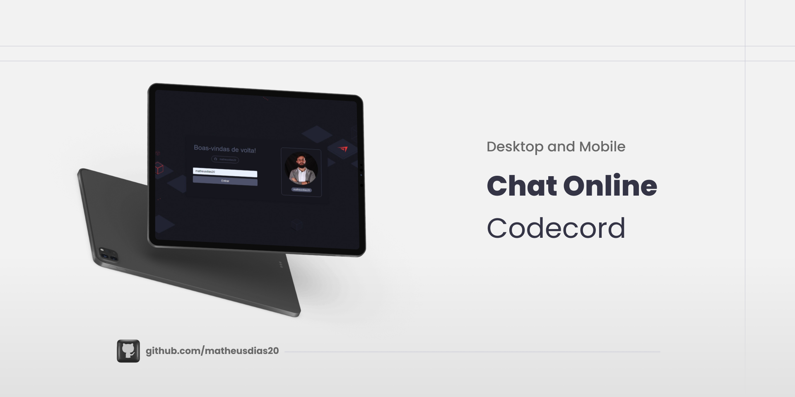

<h1 align="center">💬 Codecord</h1>

  <strong>Realizado na Imersão React da Alura. Codecord é uma aplicação de chat online.</strong>
  
 Foi usado REACT NEXT.JS no Front-End e Supabase no Back-End 

  

### Site 💻

- [Codecord](https://aluracord-code.vercel.app/)

## Linguagens: 🚀

- TypeScript

## Biblioteca: 📙

- REACT - Next.JS

## Referências: ⌨️

- [Figma](https://www.figma.com/file/X5kVg1hNCajiV73ah7iyPz/Imers%C3%A3o-React---Aluracord---Matrix?node-id=0%3A1)
- [Repositório da Imersão - Alura](https://github.com/alura-challenges/aluracord-matrix)
- [Github - Skynextui](https://github.com/alura-challenges/aluracord-matrix)

